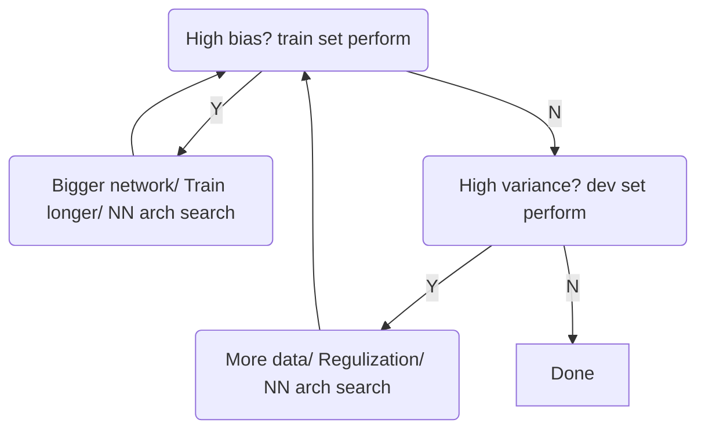

# 1. Set up Machine Learning Application
## 1.1 Train/dev/test Sets

(1) Training Set: 训练模型
(2) Dev Set (Hold-out cross validation Set): 在训练模型中评估模型，以促进优化
(3) Test Set: 测试训练好的模型是否有效的

Dev and Test Set 需来自同一数据源，否则通过 Dev 优化的模型将不适用 Test

**How to split data?**
Previos era (small scale data): 
- 70%/30% train/test
- 60%/20%/20% train/dev/test

Morden era (big data 1,000,000+):
- 98%/1%/1%


## 1.2 Bias Vs. Variance


High bias $\iff$ Underfitting
High variance $\iff$ Overfitting

使用数据来举例，例如对于一个人类判断失误率 $\approx$ 0% 的数据集
||high variance|high bias|high bias & variance| Low bias & variance
|-|-|-|-|-|
|Train set error| 1%| 15%| 15%| 0.5%
|Dev set error| 11%| 16%| 30%| 1%


## 1.3 Basic Recipe for Machine Learning




# 2. Regularize NN (Reduce Overfitting)
## 2.1 Regularization

> **Logistic regression**

$$J(\omega, b)=\frac{1}{m}\sum_{i=1}^m\mathcal{L}(\hat y^{(i)}, y^{(i)}) + \frac{\lambda}{2m}\|\omega\|_2^2$$

**L2 regulization** $\|\omega\|_2^2=\sum_{j=1}^{n_x}\omega_j^2=\omega^T\omega$ (mostly use)

Regulization parameter $\lambda$

> **Neural network**

$$J(\omega^{[1]}, b^{[1]},..., \omega^{[L]}, b^{[L]}) = \frac{1}{m}\sum_{i=1}^m\mathcal{L}(\hat y^{(i)}, y^{(i)}) + \frac{\lambda}{2m}\sum_{l=1}^L\|\omega^{[l]}\|_F^2$$

**Frobenius norm** $\|\omega^{[l]}\|_F^2=\sum_{i=1}^{n^{[l]}}\sum_{j=1}^{n^{[l-1]}}(\omega_{ij}^{[l]})^2$

> **Weight decay**

For both L2 and Frobenius

$$d\omega^{[l]} = \frac{\partial J}{\partial \omega^{[l]}} = \text{(from backprop)}+\frac{\lambda}{m}\omega^{[l]}$$

$$\omega^{[l]} := \omega^{[l]} - \alpha(d\omega^{[l]})=(1-\frac{\alpha\lambda}{m})\omega^{[l]}-\alpha\text{(from backprop)}$$

可以看到即使 backprop 为零，系数 $\omega$ 仍然会变小，因此把这样的 Regularization 称之为 Weight decay


## 2.2 Why Regulization Reduces Overfitting

设想一种比较极端的情况，当系数 $\lambda$ 很大时，为了 minimize $J$，有很多 $\omega_{ij}^{[l]}$ 会很小乃至趋近于零。此时一个 NN 可能就变成了一个 Logistic Regression（如下一图所示，也相当于在下二图中把右1变成了左1）


在例如对于 Sigmoid/tanh 这样的激活函数，当 $\omega$ 很小的时候 $z=\omega^Ta+b$ 也会趋近于零附近，因此此时的激活函数会趋近 linear


## 2.3 Dropout Regulization

通过随机消灭结点简化神经网络，从而防止过拟合


**Implement dropout ("Inverted dropout")**
例如，消除 layer 3 中 20% 的结点:

```py
keep_prob = 0.8
d3 = np.random.rand(a3.shape[0], a3.shape[1]) < keep_prob
a3 = np.multiply(a3, d3) # or a3*d3
a3 = a3/keep_prob
```

为什么最后要除以 keep_prob 呢？因为 `a3*d3` 相当于把 `Z4=np.dot(W4,A3)+b4` 也缩小了 20%，而为了使 `Z4` 保持原先的大小范围，需要将 `a3/keep_prob`


## 2.4 Understand Dropout
**Why dropout work?**
Dropout means we cannot rely on a few input features，因为这些输入结点会被随机消除，so we have to spread out weights（平均分配权重系数）

**为不同 layer 分配不同的 keep_prob**: 一般对于多个结点的 layer，keep_prob 会小一些


## 2.5 Other Regularization Methods

(1) More training data: 如果训练集是图片的话可以将其镜像/旋转/扭曲，从而丰富训练样本

(2) Stop early in gradient descent: 


# 3. Set up Optimization Problem
## 3.1 Normalize Inputs

$$x:=\frac{x-\mu}{\sigma}$$


**Why normalization?** To speed up gradient descent


## 3.2 Weight Initialization for Deep Networks
**Vanishing/ Exploding Gradients**
对于深层的神经网络，假设每层都使用线性激活函数，此时如果每一层的 $\omega>1$，那么累乘到后几层后数值将会变得非常大；反之如果每一层的 $\omega<1$，累乘后数值将趋近于零

**Weight Initialization**
For ReLU activation:
$$W^{[l]}=\text{np.random.randn}(n^{[l]},n^{[l-1]})*\sqrt{\frac{2}{n^{[l-1]}}}$$


## 3.3 Gradient Checking
梯度检验的目的是为了检查 backward propagation 的正确性

首先把所有的 $W^{[l]},b^{[l]}$ 摊平为 $\theta_i$

$$J(W^{[1]},b^{[1]},...,W^{[L]},b^{[L]})\to J(\theta)$$

然后计算近似梯度 $d\theta_{approx}$ (取 $\varepsilon=10^{-7}$)
For each i:
$$d\theta_{approx}[i]=\frac{J(\theta_1,...,\theta_i+\varepsilon,...)-J(\theta_1,...,\theta_i-\varepsilon,...)}{2\varepsilon}$$

最后比较近似梯度与实际算法梯度，如果小于 $10^{-7}$ 一般说明梯度算法是正确的，如果大于 $10^{-5}$ 则说明可能存在一些 bug
$$\frac{\| d\theta_{approx}-d\theta\|_2}{\| d\theta_{approx}\|_2 - \|d\theta\|_2}$$


