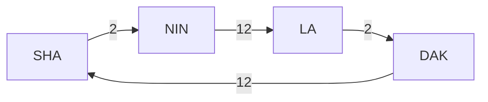

<center>

# ISYE6336 - Ocean Freight
</center>

<center></center>

## 1. Introduction
### Ranks
1. **Top Export Countries**: China, Germany, US, Japan...
2. **Top Container Ports (2012)**: Shanghai, Singapore, HK, Shenzhen...
3. **Top Container Carriers (2009)**: APM-Maersk, Mediterranean Shiping Company, CMA CGM, Evergreen Line, ..., COSCO


### Glossaries for International Freight
- **TEU**: Twenty-foot equivalent unit, a standard measure for ISO ocean intermodal containers
  - Standard containers: 40', 45'(2 TEUs), and 20' (1 TEU)
- **DWT**: Dead-weight metric tons
  - Maximum weight capacity (cargo, fuel, supplies, crew), or
  - Maximum loaded ship weight
- **Metric ton**: 1000 kg (~2200 lbs)

**Types of Container**: (1) "Dry" Container (2) Refrigerated Container (Reefer) (3) Tank Container

### Repositioning Empty Containers
- In a perfect world, every container shipment would be matched with a loaded backhaul (返程)
- About 21% of all container movements by ship are empty
- Repositioning costs add US\$3.5 **billion** a year to ocean carrier expenses (US\$1.5 billion intra-regional repositioning by road or rail)


### Container Terminals


## 2. Container Port Quayside Problems

- A **berth** or berthing areain a seaport is where ships are moored for unloading and loading operations
- **Vessels** arrive over time to the port and need to be **served**
  <u>Where should vessels be berthed, and in what order should they be served?</u>
  - Planning problems when conducted with vessel scheduling
  - Operations problems (dynamic) for re-scheduling


# Mobile Resource Management


Mobile resources:
- countainers
- chassis
- railcar
- trucks (tracktor)
- ...

`R`: receiving site (white triangle): receive one loaded means generate one empty
`G`: generating site (request empties): generate one loaded means receive one empty

`——>` menas loaded drayage (a "local" movement)
`-->` menas empty drayage

```mermaid
graph RL;

G((G))
R{R}
P[Port]

G-->P
P.->G
P-->R
R.->P
```

use **positive** number to denote generate empty containers, **negative** number to denote need empty containers (need)

```mermaid
graph LR;

F1("Facility_1 [-1]")
F2("Facility_2 [+1]")
C1("Container_yard")
P1[Port_1]
P2[Port_2]

F1-->P1-->P2-->F2
C1.->F1
```

## FLOW
units of FLOW (units/time, e.g. TEU/week)

For example, for the following service (the number on line is the days needed for shipment), `SHA` send a vessel per Tuesday with max capacity of 10,000 TEU:



then the max FLOW alone **any one** line is 10,000, while the sum of all lines is also 10,000

Denotations:
- `f`: frequency of dispatches along a cycle (units/time, e.g. ships/week, trucks/day)
- `H=1/f`: headway, the time between consecutive dispatches
- `Q`: capacity of one vessel (e.g. TEU/ship)
  - `Q*f`: measure of capacity (e.g. TEU/week)


