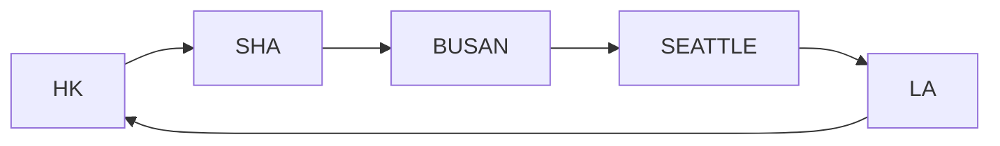
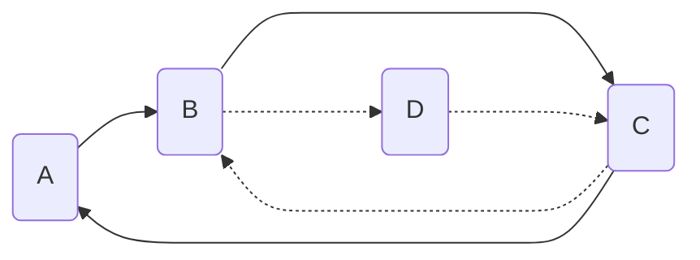

# ISYE6336 - Berth Scheduling

**Berth** or berthing areain a seaport is where ships are moored for unloading and loading operations

## 1. Parameters
For **Berth Allocation Problem (BAP)**
- Given:
  - berth layout of a container terminal
  - $V$: set of vessels to be served within a planning horizon
  - $a_k,p_k$: vessel $k$'s arrival time and proccessing time
  - $h_k$: vessel $k$'s length
  - $d_k$: due date of vessel $k$
- Decide:
  - $t_k\geq a_k$: berthing time for each vessel
  - $c_k=t_k+p_k$: completion time of vessel $k$ 
  - $b_k$: berthing position for each vessel

Such that a given objective function is optimized.

## 2. Discrete Single Berth Scheduling
### 2.1 Scheduling Objectives
**(1) MS: Makespan**
How long until all works finish?
$$\min\max_{k\in V} c_k$$

**(2) TCT: Total Completion Time**
$$\min\sum_{k\in V}c_k$$

### 2.2 Case 1: $a_k=0$ (Easy)
**MS**: $\max c_k=\sum p_k$

**TCT**: sort jobs by $1/p_1 \geq 1/p_2\geq ...\geq p_n$ (For weighted case, just sort by $w_k/p_k$)

### 2.3 Case 2: $a_k\neq 0$ (use MIP) 

MIP (Mixed-Integer Programming)

**Primary scheduling variable** $x_{kl}\in \{0,1\}$
- $x_{kl}=1$ iff vessel $k$ is completed before $l$
- which means if $x_{kl}=1$, then $t_l\geq t_k+p_k=c_k$
- therefore we can combine them into constraint one:

$$\tag{1}\boxed{t_l\geq t_k+p_k+M(x_{kl}-1)}$$

**Other constraints**:
$$\tag{2}x_{kl}+x_{lk}\geq 1$$ 

这里的大于等于相当于使用等号，因为大于1的情况会被上面的约束排除

$$\tag{3,4,5}t_k\geq a_k, \quad c_k=t_k+p_k, \quad x_{kl}\in\{0,1\}$$

## 2. Linear Berth Scheduling

**Primary scheduling variable** $x_{kl}, y_{kl}\in \{0,1\}$
- $x_{kl}=1$ iff vessel $k$ is completed before $l$
- $y_{kl}=1$ iff vessel $k$ is **completely** under $l$

### Ex: TCT Problem
$$\min \sum_{k\in V}c_k$$

- $x_{kl}+x_{lk}+y_{kl}+y_{lk}\geq 1$
- $t_l\geq t_k+p_k+M(x_{kl}-1)$
- $t_k\geq a_k$
- $c_k=t_k+p_k$
- $b_l\geq b_k+h_k+M(y_{kl}-1)$
- $b_k\geq 0$
- $b_k\leq B-h_k$

The first constraint is the key to avoid overlapping in **both time and space** (we have no overlap or only one overlap)

## 3. Multiple Berths Scheduling

现在不仅需要分配时间 $t_k$，还需要把 vessels 分配给每个 berth。理论上我们需要引入变量 $\beta_k\in \{1,2,3,...\}$ 来表示 vessel $k$ 属于第几个 berth。

但是有一种很巧妙的方式，使用两个 binary variable 来代替 $\beta_k$:
- $\boxed{w_k=1}$ iff vessel $k$ is first process at **some berth**
- $\boxed{x_{kl}=1}$ iff vessel $k$ **immediately** precedes $l$ at **the same berth**
- 这里我们不在乎每个 vessel 到底停在哪个 berth，而是用以上两个变量创建一种类似 linked list 的结构:
  - $w_k=1$ 说明 $k$ 是一条链的表头
  - $x_{kl}=1$ 说明 $l$ 在某条链中紧跟在 $k$ 后面
  - 
- Such kind of relative position variables can create **stronger lower bounds**

**Constraints**:
- $w_l+\sum_{k\neq l}x_{kl}=1$ (vessel $l$ 要么作为开头要么跟在 $k$ 后面)
- $\sum_{l\neq k}x_{kl}\leq 1$ (每个 vessel 最多只能 immediately precedes 一个 vessel)
- $\sum_k w_k\leq \Beta$ (constraint of the number of berths)

## Headway and Flows

- $\lambda$: average flow rate (production rate)

To find the minimum frequency, choose the maximum shipment size, i.e. let $q=Q$

## Cyclic dispatch fleet sizing

- $H$: headway
- $\Delta_C$: time need to finish a cycle (from departure to ready-to-departure)
- $F$: fleet size (number of vessels needed)

### Waiting time
In the case above, every vessel wait $7.5-6=1.5$ days before it's reused

To decrease the waiting time (improve the utility), we could decrease the headway to $H=2$, so that the wating time is then zero

# Ocean Container Repositioning Modeling

Model Basis
- $\lambda_{od}$: loaded demand flow from node $o$ to $d$
- $b_i$: empty demand of node $i$ ("+" means provide empty, "-" means need empty)

$$b_i=\sum_{o\in N}\lambda_{oi}-\sum_{d\in N}\lambda_{id}$$

- $Qf$: max flow capacity, where ($Q$: vessel capacity, $f$: frequency)
- $y_{ij}$: loaded flow on link $(i,j)$
- $u_{ij}$: empaty capacity on link $(i,j)$

$$u_{ij}=Qf-y_{ij}$$

## MCNF: Minimum Cost Network Flow
For a network model $G=(N,A)$, instead of using $(i,j)\in A$ to represent a arc/link, we apply $a\in A$ to represent

这是为了避免两条起点终点相同但是路径不同的路线共用一个名字

**Decision Variables**: $x_a$

**Objective**: minimize total cost
$$\min \sum_{a\in A}c_ax_a$$

**Constraints**:
- $\sum_{i\in N}b_i=0$ (Node net supply)
- $l_a\leq x_a\leq u_a$ (Feasible flow bounds)
- $b_i=\sum_{a\in\delta^+(i)}x_a-\sum_{a\in\delta^-(i)}x_a$ (Feasible flow balance: net supply = demand-out - demand-in)

### Multiple Service

## MCMCF: Multi-commodity Minimum Cost Flow

