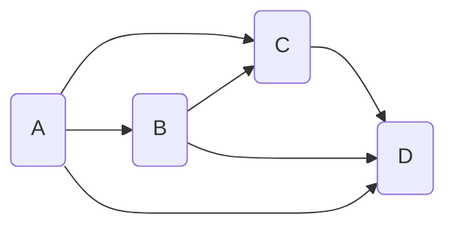
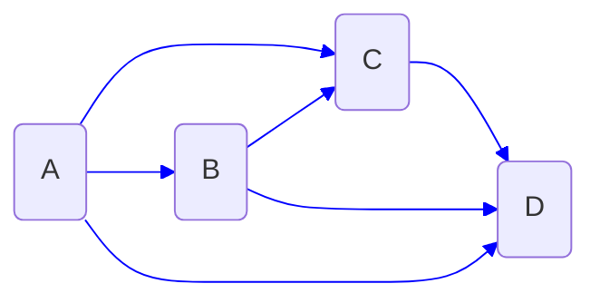
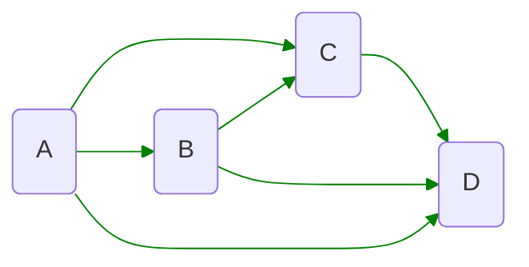

# ISYE6336 - MCNF

MCNF: Multi-commodity Network Flow Optimization

A directed network:
$$G=(N,A)$$

- $N$: nodes (decision points)
- $A$: arcs (allow representation of decisions)

**multiple "commodity" extension**: we may manage multiple TYPES of flow 
$\to$ <u>different types of flow use the same rescources!</u>
$\to$ Decision varaibles:
- $x_a^k$: decision flow for commodity $k$ on arc $a$

Notes: *units* of flow for all commodities should be *identical* (measure of size/time, e.g. lbs/week, TEU/month)

Example: For a given network model

we have:
- $G = (N,A)$
- $K=\{1,2\}$

we can turn our origion model into two models:
- Flow $x_a^1$: we have $b_i^1$

- Flow $x_a^2$: we have $b_i^2$

**Key constraints** of MC-MCF (Multi-Commodity Min Cost Flow)
1. Commodity-specific: "seperate" flow balance networks per $k$
2. Bundled capacity constraints:
   - flows of different commodities consume the same resrouces
   - arc capacity for $a$: $u_a$ such that $x_a=\sum_{k\in K}x_a^k\leq u_a$

## MC-MCF Fomulations
### TYPE I: Linear Programming Version
- **(I.a)** $c_a^k=c_a$ for common cost variant
- **(I.b)** $c_a^k$ for commodity specific costs

#### T-I.a
$$\min \sum_ac_a\Big(\sum_kx_a^k\Big)$$

- $\sum_{i\in\delta^+(i)} x_a^k - \sum_{i\in\delta^-(i)} x_a^k = b^k_i $
- $\sum_k x_a^k\leq u_a$
- $l_a^k\leq x_a^k\leq u_a^k$

### TYPE II: Integer Programming Version

#### T-II.a
$x_a^k$ is integer valued, and all the other things are same to (I.a)

Theorem: 
1. Integer single-commodity min cost flow is efficiently solvable in poly time using LP when $b_i$ are integers
2. Integer multi-commodity min cost flow in general is NP-hard (as hard as TSP)

