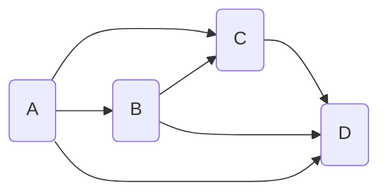
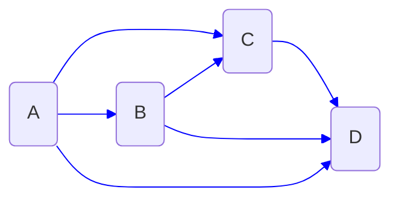
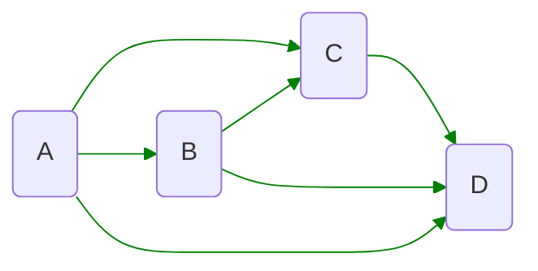

# ISYE6336 - MCNF

There are two "MCNF"s:
1. Minimum Cost Network Flow
2. Multi-commodity Network Flow (will be focused on)

## 1. MCNF: Minimum Cost Network Flow
For a network model $G=(N,A)$, instead of using $(i,j)\in A$ to represent a arc/link, we apply $a\in A$ to represent

这是为了避免两条起点终点相同但是路径不同的路线共用一个名字

**Decision Variables**: $x_a$

**Objective**: minimize total cost
$$\min \sum_{a\in A}c_ax_a$$

**Constraints**:
- $\sum_{i\in N}b_i=0$ (Node net supply)
- $l_a\leq x_a\leq u_a$ (Feasible flow bounds)
- $b_i=\sum_{a\in\delta^+(i)}x_a-\sum_{a\in\delta^-(i)}x_a$ (Feasible flow balance: net supply = demand-out - demand-in)

## 2. MCNF: Multi-commodity Network Flow
**Service Network Design**

**MCNF**: Multi-commodity/customer Network Flow Optimization

**Container-level consolidation**: shipments for multiple customers are consolidated into the same containers

A directed network:
$$G=(N,A)$$

- $N$: nodes (decision points)
- $A$: arcs (allow representation of decisions)

**Multiple "commodity" extension**: we may manage multiple TYPES of flow 
$\to$ <u>different types of flow use the same rescources!</u>
$\to$ Decision varaibles:
- $x_a^k$: decision flow for commodity $k$ on arc $a$

Notes: *units* of flow for all commodities should be *identical* (measure of size/time, e.g. lbs/week, TEU/month)

Example: For a given network model

we have:
- $G = (N,A)$
- $K=\{1,2\}$

we can turn our origion model into two models:
- Flow $x_a^1$: we have $b_i^1$

- Flow $x_a^2$: we have $b_i^2$

**Key constraints** of MC-MCF (Multi-Commodity Min Cost Flow)
1. Commodity-specific: "seperate" flow balance networks per $k$
2. Bundled capacity constraints:
   - flows of different commodities consume the same resrouces
   - arc capacity for $a$: $u_a$ such that $x_a=\sum_{k\in K}x_a^k\leq u_a$

## 3. MCMC(N)F: Multi-commodity Min Cost (Network) Flow
### TYPE I: Linear Programming Version
- **(I.a)** $c_a^k=c_a$ for common cost variant
- **(I.b)** $c_a^k$ for commodity specific costs

#### T-I.1 Arc-based model
$$\min \sum_ac_a\Big(\sum_kx_a^k\Big)$$

- Commodity-specific flow balance
  $\sum_{i\in\delta^+(i)} x_a^k - \sum_{i\in\delta^-(i)} x_a^k = b^k_i $
- Flow bundle capacity constraints
  $\sum_k x_a^k\leq u_a$
- Commodity-specific flow bounds
  $l_a^k\leq x_a^k\leq u_a^k$

#### T-I.2 Path-based model
For single-origin, single-destination problems, we can use path-based model to reduce the number of variables:

$$\min \sum_k\sum_{p\in P(k)}c_px_p^k$$

- $\sum_{p\in P(k)}x_p^k = q_{o_kd_k}$
- $\sum_k\sum_{p\in P(k):a\in p}x_p^k\leq u_a$

where
- $P(k)$: paths for commodity $k$
- $c_p=\sum_{a\in p}c_a$
- 具体实现时可以引入一个 binary variable $\alpha_{a,p}=1$ 来表示 $\alpha\in p$, 以解决第二个 constraints 的 modelling 问题

**Single-path Fomulation**
重新定义 $x_p^k=1$ 来表示 path $p$ picked for commodity $k$:

$$\min \sum_k\sum_{p\in P(k)}c_pq_{o_kd_k}x_p^k$$

- $\sum_{p\in P(k)}x_p^k = 1$
- $\sum_k\sum_{p\in P(k):a\in p}x_p^kq_{o_kd_k}\leq u_a$

### TYPE II: Integer Programming Version

#### T-II.a
$x_a^k$ is integer valued, and all the other things are same to (I.a)

Theorem: 
1. Integer single-commodity min cost flow is efficiently solvable in poly time using LP when $b_i$ are integers
2. Integer multi-commodity min cost flow in general is NP-hard (as hard as TSP)

