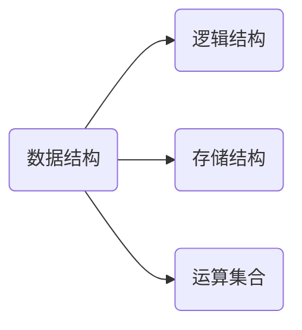

数据结构：按某种逻辑关系组织起来的一批数据，按一定的映像方式把它存放在计算机的存储器中，并在这些数据上定义了一个运算的集合

逻辑结构：元素之间的关系
- 集合：是否属于同一个集合
- 线性结构：数据元素之间存在一对一的关系
- 树型结构：一对多
- 图状结构：多对多

存储结构：
- 顺序存储结构
- 链式存储结构：在每一个数据元素中增加一个存放另一个元素地址的指针，用指针来表示数据之间的逻辑关系

时间复杂度
$O(1)$ 常数阶：一条一条执行的复制或运算语句
$O(n)$ 线形阶：一个for循环
$O(\log_2n)$ 对数阶
$O(n\log_2n)$ 线形对数阶
$O(n^k)$ 指数阶：for循环的嵌套
