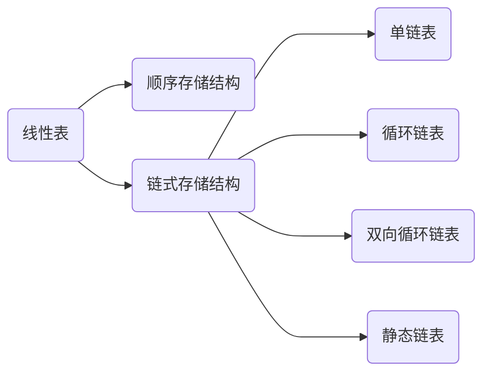

<span style="background-color: yellow; color: black;">使用 C 实现</span>


# 1. Abstract
数据元素 $D=\{a1, a2, ..., an\}$
关系 $S=\{<a_i,a_{i+1}>\vert i=1,...,n-1\}$
基本操作:
- `InitList()` 返回一个初始化的空表
- `ListLength(L)` 计算元素个数
- `GetData(L, i)` 访问第i个元素
- `InsList(*L, i, e)` 在第i个元素前插入值为e的元素
- `DelList(*L, i, e)` 删除第i哥元素，其值存在e中被返回
- `Locate(L, e)` 查找元素e的位置，找到返回序号，找不到返回0
- `DestroyList(L)` 销毁表
- `ClearList(*L)` 清空表
- `IfEmptly(L)` 判断是否为空



# 2. 线性表（顺序存储）
线性表的顺序存储结构可以借助一维数组来表示

## 2.1 定义
<details><summary><span style="background-color: lightblue; color: black;">点击查看代码</span></summary>

```c
#define SIZE 100
typedef int ElemType;
// 数据结构的定义
typedef struct{
    ElemType elem[SIZE]; // 占用的数组空间
    int last;       // 最后一个元素的下标值，空表为-1
}SeqList;

// 初始化
SeqList *InitList( ){
    SeqList *p;
    p = (SeqList *)malloc(sizeof(SeqList));
    p->last = -1;
    return p;
}

// 查找（按内容）
int Locate(SeqList *L, ElemType e){
    for(int i=0; i <= L->last; i++){
        if (L->elem[i]==e) return i+1;
    }
    return -1;
}

// 查找（按序号）
ElemType GetData(SeqList *L, int i){
    if(i <= L->last+1){
        return L->elem[i-1];
    }else{
        printf("Wrong number");
        return NULL;
    }
}

// 插值
int InsList(SeqList *L, int i, ElemType e){
    if((i<1) || (i>L->last+2)){
        printf("插入位置%d不合法", i);
        return -1;
    }else if(L->last >= SIZE-1){
        printf("表已满无法继续插入");
        return -1;
    }else{
        for(int k=L->last; k>=i-1; k--){
            L->elem[k+1] = L->elem[k];
        }
        L->elem[i-1] = e;
        L->last++;
        return 1;
    }
}

// 删除
//TODO: 这里的代码有问题，会产生EXC_BAD_ACCESS
int DelList(SeqList *L, int i, ElemType *e){
    if((i<1) || (i>L->last+1)){
        printf("删除位置%d不合法", i);
        return -1;
    }else{
        *e = L->elem[i-1]; // 该语句会报错
        for(int k=i; i <= L->last; k++){
            L->elem[k-1] = L->elem[k];
        }
        L->last--;
        return 1;
    }
}
```

</details>

## 2.2 应用示例：合并表
将两个升序排列的表合并成一个同样升序排列的新表
<details><summary><span style="background-color: lightblue; color: black;">点击查看代码</span></summary>

```c
SeqList *MergeList(SeqList *L1, SeqList *L2){
    int i=0, j=0, k=0;
    SeqList *L3;
    L3 = InitList();
    
    while(i <= L1->last && j <= L2->last){
        if(L1->elem[i] <= L2->elem[j]){
            L3->elem[k++] = L1->elem[i++];
        }else{
            L3->elem[k++] = L2->elem[j++];
        }
    }
    while(i <= L1->last){
        L3->elem[k++] = L1->elem[i++];
    }
    while(j <= L2->last){
        L3->elem[k++] = L2->elem[j++];
    }
    L3->last = L1->last + L2->last + 1;
    return L3;
}

void main(){
    SeqList *p1;
    p1 = InitList();
    for(int i=0; i<10; i++) InsList(p1, i+1, i+50);
    
    SeqList *p2;
    p2 = InitList();
    for(int i=0; i<10; i++) InsList(p2, i+1, i+45);
    
    SeqList *p3 = MergeList(p1, p2);
    for(int i=0; i<=p3->last; i++) printf("%4d", p3->elem[i]);
}
```

</details>

## 2.3 优缺点
Pros:
- 无需为表示结点元素之间的逻辑关系而额外增加存储空间
- 读取元素 $O(1)$

Cons:
- 插入/删除元素 $O(n)$
- 预先分配存储空间，不适用于表长变化大的情况

# 3. 线性表（链式存储）
每个数据结点包含两个域：
- 数据域存储结点的值
- 指针域存储指向后继结点的指针

为了操作方便，一般在单链表的第一个结点之前设置一个**头结点**，其数据域可以存放诸如链表长度之类的信息，而其指针域存储指向**第一个结点**的指针

## 3.1 定义
两种链表的创建方式：从头部插入 or 从尾部插入


<details><summary><span style="background-color: lightblue; color: black;">点击查看代码</span></summary>

```c
typedef char ElemType;

typedef struct{
    ElemType data;
    struct Node *next;
}Node, *LinkedList;

// 初始化单链表
void InitLL(LinkedList *L){ // 传入一个二级指针（指向头结点）
    // 为一级指针（头结点）分配一个地址，并将二级指针指向一级指针
    *L = (Node *)malloc(sizeof(Node));
    (*L)->next = NULL;
}

// 创建结点：从头部插入（链表顺序与输入顺序相反）
// 示例：输入"abc$"，使用 PrintLL() 后的输出结果为"c-->b-->a"
void CreateFromHead(LinkedList L){
    Node *s;
    char c;
    while(1){
        c = getchar();
        // 当输入'$'时，循环终止
        if(c != '$'){
            s = (Node *)malloc(sizeof(Node));
            s->data = c;
            s->next = L->next;
            L->next = s;
        }else break;
    }
}

// 创建结点：从尾部插入（链表顺序与输入顺序相同）
// 示例：输入"abc$"，使用 PrintLL() 后的输出结果为"a-->b-->c"
void CreateFromTail(LinkedList L){
    Node *last = L;
    Node *s;
    char c;
    while(1){
        c = getchar();
        // 当输入'$'时，循环终止
        if(c != '$'){
            s = (Node *)malloc(sizeof(Node));
            s->data = c;
            s->next = NULL;
            last->next = s;
            last = s;
        }else break;
    }
}

// 打印单链表
void PrintLL(LinkedList L){
    Node *n = L->next; // 由头结点访问第一个结点
    while(n->next != NULL){
        printf("%c-->", n->data);
        n = n->next;
    }
    printf("%c\n", n->data); // 打印尾结点
}

// 按位置查找：查找第i个结点
Node *Get(LinkedList L, int i){
    Node *n = L;
    int j = 0;
    while((n->next != NULL) && (j<i)){
        n = n->next;
        j++;
    }
    if(i == j) return n;
    else return NULL;
}

// 按数值查找：查找值为e的结点
Node *Locate(LinkedList L, ElemType e){
    Node *n = L;
    while(n->next != NULL){
        n = n->next;
        if(e == n->data) return n;
    }
    return n->next; // 找不到时，n->next == NULL
}

// 链表长度
int LengthLL(LinkedList L){
    Node *n = L;
    int len = 0;
    while(n->next != NULL){
        n = n->next;
        len++;
    }
    return len;
}

// 插入结点，在位置i插入值e
int InsList(LinkedList L, int i, ElemType e){
    Node *pre = L;
    int j = 0;
    while((pre->next != NULL) && (j<i-1)){
        pre = pre->next;
        j++;
    }
    if(!pre->next){
        printf("插入位置不合理\n");
        return -1;
    }
    
    Node *n;
    n = (Node *)malloc(sizeof(Node));
    n->data = e;
    n->next = pre->next;
    pre->next = n;
    return 1;
}

// 删除结点，删除i位置的结点并将其数值返回
ElemType DelList(LinkedList L, int i){
    Node *pre = L;
    int j = 0;
    while((pre->next != NULL) && (j<i-1)){
        pre = pre->next;
        j++;
    }
    if(!pre->next){
        printf("插入位置不合理\n");
        return '\0';
    }
    
    Node *n = pre->next;
    pre->next = n->next;
    return n->data;
}
```

</details>

## 3.2 应用示例：合并链表
将两个升序排列的链表合并成一个同样升序排列的新链表
<details><summary><span style="background-color: lightblue; color: black;">点击查看代码</span></summary>

```c
LinkedList MergeLL(LinkedList L1, LinkedList L2){
    LinkedList L3;
    InitLL(&L3);
    Node *n3;
    n3 = L3;
    
    Node *n1 = L1->next;
    Node *n2 = L2->next;
    while((n1 != NULL) && (n2 != NULL)){
        if(n1->data <= n2->data){
            n3->next = n1;
            n3 = n1;
            n1 = n1->next;
        }else{
            n3->next = n2;
            n3 = n2;
            n2 = n2->next;
        }
    }
    // n1不为NULL说明L1末尾还有几项没并入L3，直接通过指针完成合并
    if(n1 != NULL) n3->next = n1;
    else n3->next = n2;
    return L3;
}

void main(){
    LinkedList l1, l2, l3;
    InitLL(&l1);
    CreateFromTail(l1);
    PrintLL(l1);
    InitLL(&l2);
    CreateFromTail(l2);
    PrintLL(l2);
    
    l3 = MergeLL(l1, l2);
    PrintLL(l3);
}
```

</details>

# 4. 循环单链表
循环单链表的表尾结点指向表头结点
## 4.1 定义
可以通过两种方式定义循环单链表
1. 以头结点地址代表整个链表（近似于单链表）
2. <span style="background-color: yellow; color: black;">以尾结点地址代表整个链表，这种方法的优势在于，可以很容易地把两个循环单链表拼起来</span>


### 4.1.1 方式一: 头结点代表
注意 `MergeCL()` 函数，其中使用了两个while循环，$O(n)$

<details><summary><span style="background-color: lightblue; color: black;">点击查看代码</span></summary>

```c
typedef char ElemType;
typedef struct{
    ElemType data;
    struct Node *next;
}Node, *LinkedList;

// 初始化循环单链表
void InitCL(LinkedList *CL){ // 传入一个二级指针（指向头结点）
    // 为一级指针（头结点）分配一个地址，并将二级指针指向一级指针
    *CL = (Node *)malloc(sizeof(Node));
    (*CL)->next = (*CL);
}

// 创建结点：从尾部插入（链表顺序与输入顺序相同）
// 示例：输入"abc$"，使用 PrintCL() 后的输出结果为"a-->b-->c-->a"
void CreateCL(LinkedList CL){
    Node *s, *rear; // 尾结点rear
    rear = CL;      // 初始状态下头结点 = 尾结点
    char c;

    while(1){
        c = getchar();
        // 当输入'$'时，循环终止
        if(c != '$'){
            s = (Node *)malloc(sizeof(Node));
            s->data = c;
            rear->next = s;
            rear = s;
        }else break;
    }
    rear->next = CL; // 把尾结点rear指向头结点
}

// 打印循环单链表
void PrintCL(LinkedList L){
    Node *n = L->next; // 由头结点访问第一个结点
    while(n != L){     // 当n不为头结点时，循环打印
        printf("%c-->", n->data);
        n = n->next;
    }
    n = n->next; // 循环结束后n为头结点，因此需要再赋值一次以访问第一个结点
    printf("%c\n", n->data); // 打印第一个结点，表示链表的循环
}

LinkedList MergeCL(LinkedList L1, LinkedList L2){
    Node *n1 = L1->next;
    Node *n2 = L2->next;
    while (n1->next != L1) n1=n1->next; // L1的尾结点
    while (n2->next != L2) n2=n2->next; // L2的尾结点

    n1->next = L2->next; // L1的尾结点连接L2的第一个结点
    n2->next = L1;       // L2的尾结点连接L1的头结点
    free(L2);
    return L1;
}

void main(){
    LinkedList cl1, cl2, cl3;
    InitCL(&cl1);
    CreateCL(cl1);
    PrintCL(cl1);

    InitCL(&cl2);
    CreateCL(cl2);
    PrintCL(cl2);

    cl3 = MergeCL(cl1, cl2);
    PrintCL(cl3);
}
```

</details>

### 4.1.2 方式二: 尾结点代表
这里的 `MergeCL()` 为 $O(1)$

<details><summary><span style="background-color: lightblue; color: black;">点击查看代码</span></summary>

```c
// 创建循环单链表结点：从尾部插入（链表顺序与输入顺序相同）
LinkedList CreateCL(LinkedList CL){
    Node *s, *rear; // 尾结点rear
    rear = CL;      // 初始状态下头结点 = 尾结点
    char c;

    while(1){
        c = getchar();
        // 当输入'$'时，循环终止
        if(c != '$'){
            s = (Node *)malloc(sizeof(Node));
            s->data = c;
            rear->next = s;
            rear = s;
        }else break;
    }
    rear->next = CL; // 把尾结点rear指向头结点
    return rear;     // 返回尾结点代表循环单列表
}

// 打印循环单链表
void PrintCL(LinkedList L){
    Node *n = L->next;   // 由尾结点访问头结点
    n = n->next;         // 再访问第一个结点
    while(n != L->next){ // 当n不为头结点时，循环打印
        printf("%c-->", n->data);
        n = n->next;
    }
    n = n->next; // 循环结束后n为头结点，因此需要再赋值一次以访问第一个结点
    printf("%c\n", n->data); // 打印第一个结点，表示链表的循环
}

LinkedList MergeCL(LinkedList L1, LinkedList L2){
    Node *head1 = L1->next;
    Node *head2 = L2->next;
    
    L1->next = head2->next; // L1的尾结点连接到L2的第一个结点
    L2->next = head1;       // L2的尾结点连接到L1的头结点
    
    return rear2;
}

void main(){
    LinkedList cl1, cl2, cl3;
    InitCL(&cl1);
    cl1 = CreateCL(cl1);
    PrintCL(cl1);

    InitCL(&cl2);
    cl2 = CreateCL(cl2);
    PrintCL(cl2);

    cl3 = MergeCL(cl1, cl2);
    PrintCL(cl3);
}
```

</details>

# 5. 双向循环链表
## 5.1 定义

双向循环列表的每个结点都包含**三个元素**：
1. prior 指针指向前一个元素的地址
2. data 储存值
3. next 指针指向后一个元素的地址

下图展示了一个空的双向循环链表的结构，以及插值的过程


在删除结点的过程中，<span style="background-color: yellow; color: black;">需要按如下顺序执行</span>，如果先执行步骤2 `(p->next)->prior = p->prior`，那么之后 `p->prior` 将变得无意义，最终使得步骤1 `(p->prior)->next = (p->next)` 无法执行


<details><summary><span style="background-color: lightblue; color: black;">点击查看代码</span></summary>

```c
typedef char ElemType;
typedef struct{
    ElemType data;
    struct Node *prior, *next;
}DNode, *DoubleList;

// 初始化双向循环链表
void InitDL(DoubleList *DL){ // 传入一个二级指针（指向头结点）
    // 为一级指针（头结点）分配一个地址，并将二级指针指向一级指针
    *DL = (DNode *)malloc(sizeof(DNode));
    (*DL)->prior = (*DL);
    (*DL)->next = (*DL);
}

// 创建双向链表结点：从头部插入（链表顺序与输入顺序相反）
void CreateDL(DoubleList DL){
    DNode *s, *p, *pp; // 尾结点rear
    char c;

    while(1){
        c = getchar();
        // 当输入'$'时，循环终止
        if(c != '$'){
            s = (DNode *)malloc(sizeof(DNode));
            s->data = c;
            
            // 以下代码实现在p结点前插入s结点，pp = p->prior
            // pp&p 都可以用DL化简掉，这里是为了增强代码可读性
            pp = DL;
            p = DL->next;
            
            s->prior = pp;
            pp->next = s;
            s->next = p;
            p->prior = s;
        }else break;
    }
}

int DLinkInsert(DoubleList DL, int i, ElemType e){
    DNode *s, *p, *pp;
    int k=0;
    p = DL;
    while((p->next != DL) && (k < i)){
        p = p->next;
        k++;
    }
    if(k!=i){
        printf("插入位置不合适");
        return -1;
    }
    pp = p->prior;
    
    s = (DNode *)malloc(sizeof(DNode));
    s->data = e;
    s->prior = pp;
    pp->next = s;
    s->next = p;
    p->prior = s;
    return 1;
}

ElemType DLinkDelete(DoubleList DL, int i){
    DNode *p, *pp, *np; // Node p, prior pp, next np
    int k=0;
    p = DL;
    while((p->next != DL) && (k < i)){
        p = p->next;
        k++;
    }
    if(k!=i){
        printf("删除位置不合适");
        return '\0';
    }
    pp = p->prior;
    np = p->next;
    pp->next = np;
    np->prior = pp;
    
    ElemType deldata = p->data;
    free(p);
    return deldata;
}

// 打印双向循环链表
void PrintDL(DoubleList DL){
    DNode *n = DL->next;   // 由头结点访问第一个结点
    while(n != DL){        // 当n不为首结点时，循环打印
        printf("%c<-->", n->data);
        n = n->next;
    }
    n = n->next; // 循环结束后n为首结点，因此需要再赋值一次以访问第一个结点
    printf("%c\n", n->data); // 打印第一个结点，表示链表的循环
}

void main(){
    DoubleList dl1;
    InitDL(&dl1);
    CreateDL(dl1);
    PrintDL(dl1);
    
    DLinkInsert(dl1, 3, 'e');
    PrintDL(dl1);
    ß
    ElemType deldata = DLinkDelete(dl1, 3);
    PrintDL(dl1);
    printf("Deleted data: %c\n", deldata);
}
```

</details>

# 6. 静态链表
静态链表即模拟链表，实现：
1. 用数组 `StaticList[]` 模拟内存
2. 用数组下标 `cursor` 模拟指针，头结点的cursor为`0`，尾结点为`-1`
3. 编写从数组中分配和回收结点的方法

## 6.1 定义
### 6.1.1 静态链表的创建、插入结点与删除结点


上图中的**删除操作并不完整**，因为结点 `StaticList[6]` 虽然被删除但没有被回收，也就是说我们在之后的<span style="background-color: yellow; color: black;">需要按如下顺序执行</span>插入操作中无法定位到这个结点</span>，这会导致静态链表在多次插入删除操作之后“假满”

解决方式：创建一个“**空闲链表**”连接所有未被分配存储空间的结点以及因删除操作而回收的结点

### 6.1.2 链表的初始化
- 头结点为尾结点：`StaticList[0].cursor = -1`
- 初始化"**空闲链表**"，并创建一个头指针指向该链表的第一个元素


```c
void InitSL(StaticList space, int *av){
    space[0].cursor = -1;
    // 建立"空闲链表"
    for(int k=1; k<SIZE-1; k++){
        space[k].cursor = k+1;
    }
    space[SIZE-1].cursor = -1; // 标记尾链
    *av = 1; // "空闲链表"的头指针
}
```

### 6.1.3 结点空间的分配和回收
```c
// 分配结点
int getNode(StaticList space, int *av){
    int i = *av;
    *av = space[*av].cursor;
    return i;
}

// 回收结点
void freeNode(StaticList space, int *av, int k){
    space[k].cursor = *av;
    *av = k;
}
```

其他函数类似于单链表

# 6. 小结
几种操作结构总结


