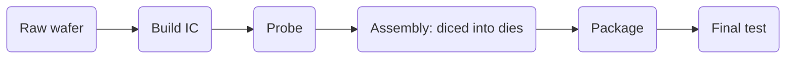

|Acronym| Definition| 
|-|-|
|BAW| Bulk Acoustic Wave 散装声波滤波器|
|DPS| Die (or Dice) Processing
|GDPW| Gross Die Per Wafer (e5)|
|IC| Integrated Circuit|
|PM| Preemptive Maintanance
|SAW| Surface Acoustic Wave 表面声波滤波器|
|WSPD| Wafter Starts Per Day|

![[Snipaste_2023-05-17_09-37-22 2.png]]

Wafer fab > work areas > work centers (a set of machines that provide similar processing capabilities) > machines (or tools, can have a buffer to store lots)

Lots: moving entities in wafer fabs (obtained from order)
- Often, several lots will be created to fulfill an order

Tools (machines):
- Single wafer tools: process only a single wafer at a time
- Tools with overlapping process: process lots in an overlapping manner
- Batch processing tools:
    - **batch**: a set of lots that processed at the same time on a single tool
- Cluster tools: 具有不同类型工艺步骤的晶圆可以同时在一个集群工具上循环，也就是说，集群工具可以被看作是一个完全自动化的机器环境。一个集群工具是一个单一的设备，它聚集了几个工艺步骤以及运输和计量

Steps:
1. **Oxidataion**/**Diffusion**: A layer of material is grown or deposited on the surface of a cleaned wafer. The goal of an oxidation step is to grow a dioxide layer on a single wafer, while diffusion aims at dispersing material on the wafer surface. Diffusion furnaces and rapid thermal equipment are used in the oxidation/diffusion work area. The furnaces are batch processing tools.
2. **Film deposition** (薄膜沉积): Films are deposited onto wafers when the deposition step is carried out. Dielectric or metal layers are deposited. A dozen or even more such deposition layers can be found in advanced integrated circuits. Deposition can be executed by processes such as physical vapor deposition (PVD) or chemical vapor deposition (CVD).
3. **Photolithography**:
4. **Etch**: A wafer is partially covered by photoresist strip after photolithography. Material is removed from the areas of the wafer surface that are not covered by the etching step. 
5. **Ion implantation** 离子注入: Doping material is deposited where parts of the wafer have been etched.
6. **Planarization** 平坦化, 类似于抛光: The wafer surface is cleaned and leveled by the planarization step.
7. **Cleaning/Inspection/Measurement**

- 沉积: 在晶圆表面沉积一层 SiO2, SiN 等绝缘介质薄膜和 Al, Cu 等金属导电膜
- 光刻:
    - 涂抹光刻胶
    - 曝光: 紫外线照射掩膜，穿过透镜设在光刻胶上（被紫外线照射后的光刻胶变得可溶）
- 显影: 使用显影液冲洗可溶的光刻胶
- 蚀刻: 把没有光刻胶覆盖的区域的氧化膜(和下方的硅一起)刻掉，形成一个突起的结构，也就是鳍式场效应晶体管的“鳍”

- 如此不断的重复

# Building Blocks for a Simulation Model of a Wafer Fab
## Overview
we have to represent in a fab simulation model the following ingredients: 
- resources: equipment, secondary resources, and operators 
- products, technologies and process flows 
- orders, lots, and batches. 

Closely related to the resources are elements of the **control system** (dispatching and batching rules).
- Dispatching rules determine which lot will be processed next at an available tool.
- Batching rules that decide which lots form a batch and which   batch will be processed next are also part of the control system. Batching rules can be considered as extension of dispatching   rules. We refer to (Sarin et al. 2011 and Mönch et al. 2013) for a more detailed discussion of dispatching and batching rules in   semiconductor manufacturing.

## Resource Modeling
The following tool-related information is generally used:
- name of the work center 
- number of tools in the work center 
- name of an individual tool 
- batch-size information 
- batch formation criterion 
- setup time information
- tool qualification and dedication requirements 
- information on preventive maintenance (PM) cycle(s) 
- information on breakdown-repair cycle(s) 
- information related to the dispatching rule used at the tools of the work center. 

More than one lot can be processed on a batch processing tool. The maximum number of lots that can be processed in a single   batch has to be specified. A given minimum number of lots is required in many wafer fabs. This quantity is called minimum   batch size and has to be specified in a simulation model. The batch formation criterion is used to represent the information   which lots can be used to form a batch. Often only lots that refer to the same process step can be batched together.

The setup time is necessary to set up a tool before processing. The setup time can be independent from the current setup   state. In this situation, we have a constant setup time that appears whenever a new process step has to be performed on the tool.   When the setup time depends on the current setup state, sequence-dependent setup times have to be modeled. This requires a   setup matrix.

Since semiconductor equipment is complex, it is important that the equipment is running in an appropriate way.   Therefore, PM activities can be found in most fab simulation models. Weekly, monthly, quarterly, and yearly PM schedules   are possible. Many simulation tools use calendars for modeling PM activities.

Since semiconductor equipment is complex, it is important that the equipment is running in an appropriate way.   Therefore, PM activities can be found in most fab simulation models. Weekly, monthly, quarterly, and yearly PM schedules   are possible. Many simulation tools use calendars for modeling PM activities.

## Product Representation
**A process flow** is represented by a list that contains information for all **process step**s that are required to produce a specific product, also might contain alternative subprocess flows or rework loops. 

The information needed to represent a single process step includes:
- name of the process step 
- name of the tool group where the process step has to be performed 
- $t_{ps}$: processing time given either as a deterministic value or by a probability distribution and information as to whether the processing time refers to the entire lot or a single wafer 
- load and unload time 
- required setup state of the machine when the process step is carried out 
- amount of scrapped material (报废材料)
- required secondary resources 
- operator requirements including skills, availability requirements, quantity of required workers 
- rework loops 
- alternative flows

## Modeling of Working Objects
Lots are the moving entities in wafer fabs:
- name of the lot 
- number of wafers (might influence the processing time of the lot)
- product type (specify which process flow will be used)
- start time 
- due date 
- weight (priority)

In contrast to lots, batches are created only temporary in front of batch processing tools

## Reduced Simulation Models
Simulation studies with full fab models tend to be <u>time-consuming</u> (too much details is modeled). The reduction is carried out by **modeling only process steps on bottleneck machines in detail**. 

The process steps that are not related to bottleneck machines are replaced by fixed time delays: (It's challanging to calculate an appropriate delay, which could be based on historical data, or accurated by the complete simulation)

