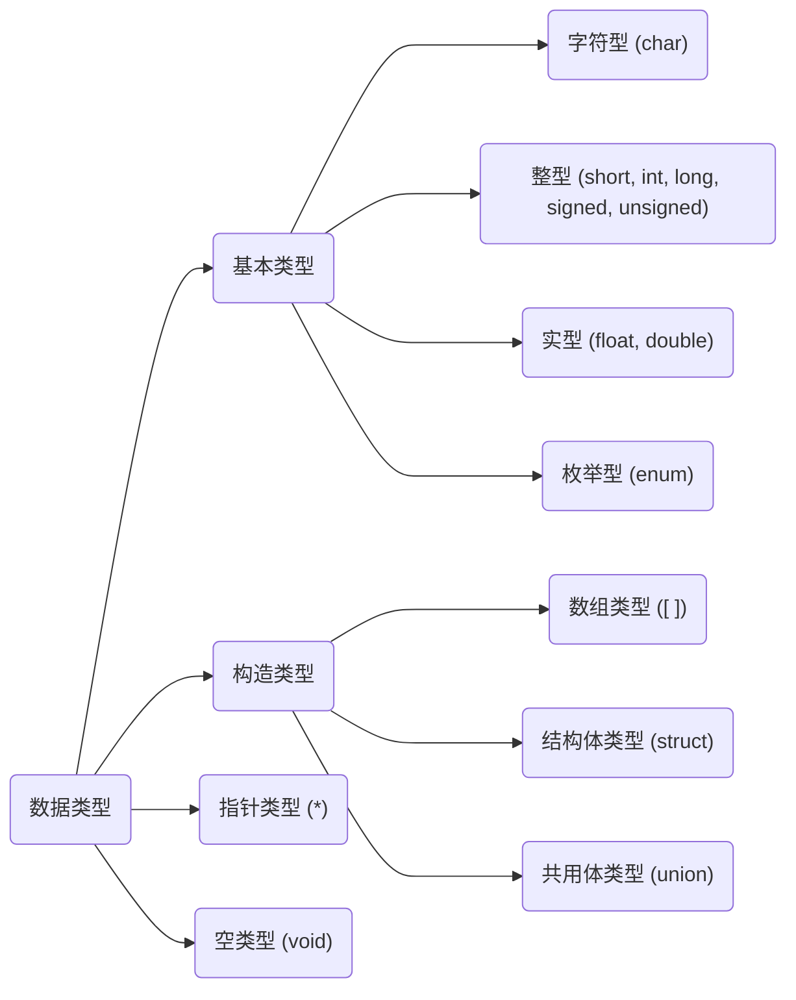

```c
#include <stdio.h> // 标准输入输出头文件
void main( ) {
    int input, min=0;
    scanf("%d", &input);
    if(input < min) min = input;
    else;
    printf("min = %d\n", min);
}
```


```mermaid
graph LR
A(数据类型)
    A-->B1(基本类型)
        B1--->C11("字符型 (char)")
        B1--->C12("整型 (short, int, long, signed, unsigned)")
        B1--->C13("实型 (float, double)")
        B1--->C14("枚举型 (enum)")
    A-->B2(构造类型)
        B2--->C21("数组类型 ([ ])")
        B2--->C22("结构体类型 (struct)")
        B2--->C23("共用体类型 (union)")
    A-->B3("指针类型 (*)")
    A-->B4("空类型 (void)") 
```