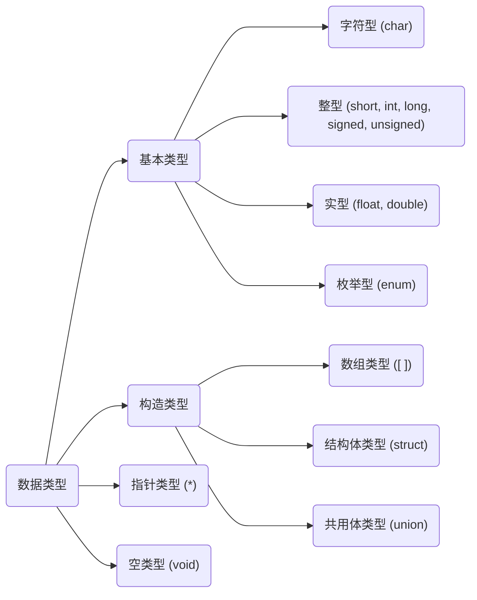

```c
#include <stdio.h> // 标准输入输出头文件
void main( ) {
    int input, min=0;
    scanf("%d", &input);
    if(input < min) min = input;
    else;
    printf("min = %d\n", min);
}
```

`stdio.h` standard input output head



# 1. 数据类型
> **常量**

```c
#define PI 3.14
```
> **转译字符**

```c
"\n" // 换行
"\t" // 横向跳格
"\b" // 退格
"\r" // 回车
"\\" // 反斜杠
"\'" // 单引号字符
```

## 1.1 变量
### 1.1.1 变量的存储特性
静态变量 `static`
- 静态局部变量，声明、使用于函数内部，特点是不会随着函数运行的结束而销毁，默认值为 `0` or `'\0'`。一般用于<span style="background-color: yellow; color: black;">保留该变量函数在上次调用结束后的值</span>
- 静态全局变量

寄存器 `register`
- 用于修饰需要被高频访问的变量，例如 `register int x;`。一般只允许声明两个寄存器变量

### 1.1.2 整型与浮点型
> **整型**

范围与大小
1. `short`,`int`: $-2^{15}\sim2^{15}-1$ (2 byte = 16 digit)
2. `long`: $-2^{31}\sim2^{31}-1$ (4 byte = 32 digit)

符号
```c
[signed] int n; // 默认有符号
unsigned int n; // 设置为无符号
```

八进制、十六进制整型
```c
int n8 = 012;   // = 1*8^1 + 2*8^0 = 10
int n16 = 0X12; // = 1*16^1 + 2*16^0 = 18
```

> **浮点型**

`float` 精确到7位（包括小数点前后）4 digit
`double` 精确到15位（包括小数点前后）8 digit

### 1.1.3 字符与字符串
C语言中没有字符串对象，因此使用字符数组来储存字符串
```c
char c = 'a';
char s[] = "abc";
```
相关函数
```c
#include <string.h>

strcmp(str1, str2);  // 比较字符串：相等返回0，str1>str2返回正整数，反之负整数
int l = strlen(str); // 计算长度
```

## 1.2 运算符
> **算术运算符** `+`, `-`, `*`, `/`, `%`(取余)

`++`, `--`: `a++` 先赋值再运算，`++a` 先运算再赋值（example见Section-逻辑运算符）

整形与整形相除得整形，整形与浮点型的任何算术操作均得浮点型

> **位运算符** 计算每个digit，`&`, `|`, `^`(异或)

> **关系运算符** `!=`

C语言使用 `0`, `1`(int) 表示 `False`, `True`。例如 `2<5<2 = 1<2 = 1` 

### 1.2.1 逻辑运算符
`!`, `&&`, `||`
逻辑变量与其他运算符之间的转换（注意方向性）：