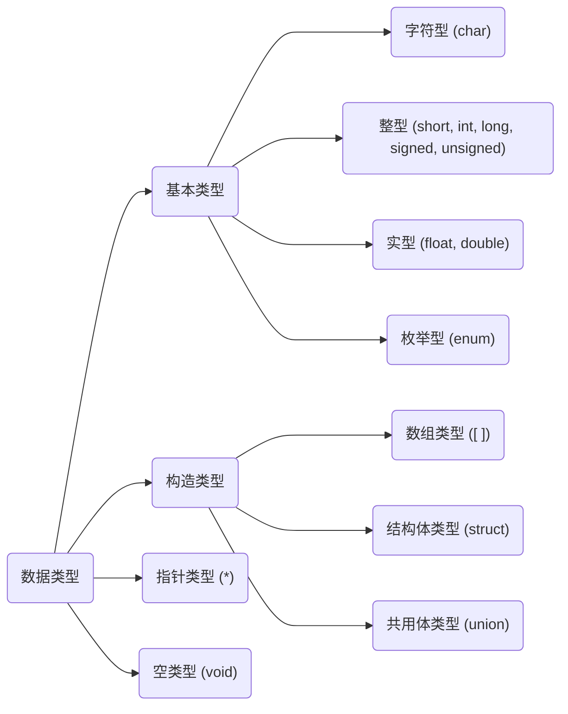
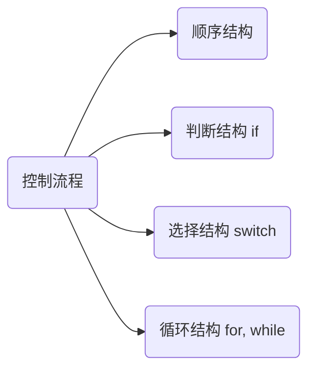

```c
#include <stdio.h> // 标准输入输出头文件
void main( ) {
    int input, min=0;
    scanf("%d", &input);
    if(input < min) min = input;
    else;
    printf("min = %d\n", min);
}
```

`stdio.h` standard input output head



# 1. 数据类型
> **常量**

```c
#define PI 3.14
```
> **转译字符**

```c
"\n" // 换行
"\t" // 横向跳格
"\b" // 退格
"\r" // 回车
"\\" // 反斜杠
"\'" // 单引号字符
```

## 1.1 变量
### 1.1.1 变量的存储特性
静态变量 `static`
- 静态局部变量，声明、使用于函数内部，特点是不会随着函数运行的结束而销毁，默认值为 `0` or `'\0'`。一般用于<span style="background-color: yellow; color: black;">保留该变量函数在上次调用结束后的值</span>
- 静态全局变量

寄存器 `register`
- 用于修饰需要被高频访问的变量，例如 `register int x;`。一般只允许声明两个寄存器变量

### 1.1.2 整型与浮点型
> **整型**

范围与大小
1. `short`,`int`: $-2^{15}\sim2^{15}-1$ (2 byte = 16 digit)
2. `long`: $-2^{31}\sim2^{31}-1$ (4 byte = 32 digit)

符号
```c
[signed] int n; // 默认有符号
unsigned int n; // 设置为无符号
```

八进制、十六进制整型
```c
int n8 = 012;   // = 1*8^1 + 2*8^0 = 10
int n16 = 0X12; // = 1*16^1 + 2*16^0 = 18
```

> **浮点型**

`float` 精确到7位（包括小数点前后）4 digit
`double` 精确到15位（包括小数点前后）8 digit

### 1.1.3 字符与字符串
C语言中没有字符串对象，因此使用字符数组来储存字符串
```c
char c = 'a';
char s[] = "abc";
```
相关函数
```c
#include <string.h>

strcmp(str1, str2);  // 比较字符串：相等返回0，str1>str2返回正整数，反之负整数
int l = strlen(str); // 计算长度
```

## 1.2 运算符
> **算术运算符** `+`, `-`, `*`, `/`, `%`(取余)

`++`, `--`: `a++` 先赋值再运算，`++a` 先运算再赋值（example见Section-逻辑运算符）

整形与整形相除得整形，整形与浮点型的任何算术操作均得浮点型

> **位运算符** 计算每个digit，`&`, `|`, `^`(异或)

> **关系运算符** `!=`

C语言使用 `0`, `1`(int) 表示 `False`, `True`。例如 `2<5<2 = 1<2 = 1` 

### 1.2.1 逻辑运算符
`!`, `&&`, `||`
逻辑变量与其他运算符之间的转换（注意方向性）：
- `0 || 0.0 || '\0' || NULL` $\to$ `False` $\to$ `0`
- `非零` $\to$ `True` $\to$ `1`

示例
```c
int a=0, b=1, c;
c = (a++) && (b=3) // 由于是先赋值再运算，因此左侧a=0=False，直接判假，并不再进行右侧的赋值操作

>>>
a = 1; b = 1; c = 0;
 ``` 

### 1.2.2 条件运算符
```c
int max, a=1, b=2;
max = a>b? a: b;
 ```

## 1.3 数据类型转换
**自动转换**：由所占空间小的向占空间大的方向转变，例如在运算中常发生的 `int`$\to$`double`

**赋值转换**: 
- `int=double` 把小数砍掉，但可能因为double太大导致数值剧变
- `double=int` 补满欠缺位，数值大小不变

**强制类型转换**: `a = (double)a`

# 2. 函数
## 2.1 常用函数
### stdio.h
#### 输入输出
> **标准输出**
```c
printf("格式说明", [变量名])
```
`格式说明` = `%[flag][width][.prec][F|N|h|L][type]`
- `[flag]`: 
`-` 左对齐右边补空格，否则右对齐左边补空格
`+`: 正数输出正号，负数输出负号
`空格`: 正数输出空格，负数输出负号
- `[width]`: 限定输出的最小的宽度，少则补空格，多不变
- `[.prec]`: 小数点后的精确位数
- `[F|N|h|L]`: 长度修饰符，与指针相关
- `[type]`: d整形，f浮点型，c字符, s字符串

示例：
```c
float pi = 3.14159;
printf("%+6.2f", pi);
>>>
" +3.14" // 包括符号、数字和空格，一共6位
 ``` 

> **标准输入**
```c
scanf("格式说明", [变量名首地址])
 ```
- `格式说明` = `%[*][width][F|N][h|l][type]`，其中 `[*]` 为赋值抑制字符，其余同上
- `变量名首地址`: 若为变量，需在前加上取地址符 `&`，数组名和地址不用加

示例：
```c
scanf("%3d %*3d %3d", &n1, &n2);
printf("n1=%d, n2=%d", n1, n2);

>>> 123 456 789
"n1=123, n2=789"
```

> **字符/字符串的输入输出**
```c
// 字符
putchar(变量名 or 'A' or ''\n'');
变量名 = getchar();

// 字符串
puts(字符数组名 or "string")
gets(字符数组名)
 ```

注意事项：
- 如果多个输入写在一起，需要一次性全部输入(不能用空格作为间隔)，再按回车确认。当多个 `getchar()` 写在一起时，按次序读取；但当 `getchar()` 写在另外两个输入方法之后时，会直接失效
```c
s1 = getchar();
s2 = getchar();
// 输入 'a1' 表示 s1='a', s2='1'

s1 = getchar();
scanf("%d", &n1);
s2 = getchar();
// 输入 '123' 表示 s1='1', n1=23, s2=NULL
 ```

### stdlib.h
#### 内存管理函数
```c
#include stdlib.h;
int *p = (int *)malloc(50); // 分配一块50字节的空间，并返回首地址
free(p); // 释放空间
```


## 2.2 自定义函数
```c
// 声明定义的函数，也可以写在main函数内
float func_max(float a, float b);

void main( ) {
    printf("%f", func_max(5, 8));
}

float func_max(float a, float b){
    return (a>b)? a: b;
}
```

### 2.2.1 形参与实参
- 形参: 定义函数时所定义的输入，如上例中 `float a, float b`
- 实际: 调用函数时的实际输入
- 传参方式分为传值调用和传地址调用，其中<span style="background-color: yellow; color: black;">传地址调用</span>会使得输入的实参随着形参的变化而变化

### 2.2.2 函数作为形参输入
```c
int add(int a, int b){ return a+b; }
int compute(int x, int y, int (*p)()){
    return (*p)(x,y);
}
void main(){
    result = compute(1, 2, add)
}
```

## 2.3 递归 
汉诺塔问题
```c
void hanot(int n, char a, char b, char c){
    if (n==1) printf("%c --> %c\n", a, c);
    else{
        hanot(n-1, a, c, b);
        hanot(1, a, b, c);
        hanot(n-1, b, a, c);
    }
}
```
斐波那契数列
```c
int fibonaci(int n){
    if (n==1 || n==2) return 1;
    return fibonaci(n-1) + fibonaci(n-2);
}
```

# 3. 程序控制流程


```c
/* --------- */
/* 判断结构 if */
if (a<0) a=0;

if (a<0) a=0;
else if (a>0) a++;
[else;]

/* ------------- */
/* 选择结构 switch */
switch(a){
    // 若不加break，则会执行其后的所有语句。例如当a=2时，则输出"a=2\na is unknown"
    case 1: printf("a=1"); break;
    case 2: printf("a=2"); break;
    [default: printf("a is unknown");]    
}

/* ----------------- */
/* 循环结构 for, while */
while (i<=100){
    sum += i;
    i++;
}

do{
    sum += i;
    i++;
}while (i<=100);

for (int i=0, sum=0; i<10; i++){
    sum += i;
}
```
continue, goto
```c
// 输出指定范围内的所有偶数
for (int i=0; i<10; i++){
    if(i%2 != 0) continue;
    printf("%d", i);
}

// 利用goto求和
int i=0, sum=0;
loop: sum += i;
i++;
if(i<=100) goto loop;
```

# 4. 数组
```c
[存储特性] 数据类型 数组名[长度];

static int a1[5];
// 以下三种方式等效
int a2[5] = {1,2,0,0,0};
int a3[5] = {1,2}; // 其他自动赋零
int a4[ ] = {1,2,0,0,0};

int b1[2][3];

char c1[4] = " 123";
// 使用字符串作为数组输入时，系统会多加一个'\0'在末尾作为结束标志
// 因此这里的长度为4
char c2[][4] = {"abc", "def"}; 
```

存储与访问
- 数组内的各元素在内存中分配一片连续的存储单元，二维数组按行一次存储
- 数组的首元素地址即为数组地址
- 某元素地址 = 首地址 + 下标*sizeof(数据类型)

## 4.1 排序算法
**选择排序**：以从小到大排序为例，每次将未排序的第一个数字，与所有未排序数字中最小的数字做交换
```c
3 6 2 4 1 5
1 6 2 4 3 5
1 2 6 4 3 5
1 2 3 4 6 5
1 2 3 4 5 6
```

**冒泡排序**: 以从大到小为例，首先在A[0]-A[n]区间内，从A[0]开始比较相邻数字的大小，如果将小的交换至右侧（视为一次冒泡）；在区间A[0]-A[n-1], A[0]-A[n-2]...重复n-1次同样的操作
```c
1 2 4 3
// A[0]-A[3]
2 1 4 3
2 4 1 3
2 4 3 1
// A[0]-A[2]
4 2 3 1
4 3 2 1
// A[0]-A[1]
4 3 2 1
```

## 4.2 处理数组（复制）
```c
#include <string.h>

int a1[3] = {0,1,2};
int a2[3];
char s1[10] = "Hello,";
char s2[10] = " World";

memcpy(a2, a1, sizeof(a1)); // 复制数组
strcat(s1, s2);             // 连接字符数组 s1 = "Hello, World"
```

## 4.3 数组作为函数参数
由数组是以地址的形式作为参数传入函数，因此函数内对传入数组的改变会改变函数外数组的数
```c
void func(int a[]){
    a[0] = 2;
}

void main(){
    int a[] = {1,2};
    func(a);
}
```


# 5. 指针
## 5.1 内存与指针的定义

内存地址与变量地址
- 内存地址：内存以一个字节为存储单元，每个字节单元编号唯一
- 变量地址：变量所分配存储空间的首字节地址

**内存与变量的访问方式**
- 直接存取：一般的赋值方式
- 间接存取：定义一种<span style="background-color: yellow; color: black;">特殊变量`p`专门存放内存或变量`a`的地址，再根据该地址去访问`a`</span>，也称`p`指向`a`

**指针变量的定义**
```c
指针所指向的变量的类型 *指针名 = &所指向变量的的变量名;

int a, *p=&a;
```

**指针的使用**
`*`在定义时表名`p`为指针型变量；而在使用时则为取值运算符此
```c
*p ==a
*&a==a

*p=12; // 等价于 a=12
```

多级指针：指向指针的指针
```c
int a, *p1=&a, **p2=&p1;
```

## 5.2 指针的算术运算
可以对指针变量做 `++,--,+,-` 等算术运算，例如对于 
```c
int a[3], *p=a; // 这里不用&是因为数组名存储数组的首元素地址
*p==a[0];

p+=2;
*p==a[2]; // 实际上增加了2*4个字节
```
```c
*p++ == *(p++)
x = p++; // x指向元素n，p指向元素n+1
x = ++p; // x,p均指向元素n+1
```

## 5.3 指针与函数、数组、字符串

1. 指针作为函数参数
```c
// 地址传递，数值交换
void exchange_value(int *p1, int *p2){
    int t;
    t = *p1; // *p1: p1所指向的变量数值
    *p1 = *p2;
    *p2 = t;
}
```

2. 指针函数: 返回值为地址的函数
```c
int *max(int x, int y){ }
int *pm = max(1, 2);
```

3. 指针与一维数组
```c
int a[10], *p;
// 指针指向数组（以下两行等价）
p = &a[0];
p = a;
// 通过指针引用数组元素（以下三行等价）
a[i];
p[i];
*(p+1);
```

4. 指针与二维数组：二维数组等同于一维数组的数组

```c
int a[6][6];
&a == &a[0] == &a[0][0]

// 使用指针访问a[n][m]
// 方式一
*(*(a+n)+m)
// 方式二
int (*p)[4];
p = a[0]; // a[0]是一个地址
*(*(p+n)+m)
// 方式三
p = a[0]; // == p=&a[0][0]
*(p += n*6+m)
```


5. 指针与字符串

一般的常量没有地址，但是字符串常量比较特殊，会占用一段内存空间，因此可以用指针表示其首地址
```c
char *str1 = "Str1";
char s[]="Str1", *str2=s;
printf("%s", str1); 
printf("%s", str2); 
```

6. 指针与字符串数组（指针数组）
```c
char fruit[3][10] = {"apple", "orange", "lemon"};
char *p[3] = {"apple", "orange", "lemon"};
```

## 5.4 传参该传几级地址
传一级地址改变指向变量的值
```c
void change(int *p){
    *p = 5;
}
void main(){
    int i = 0;
    change(&i); // i=5 here
}
```
传二级地址改变指针（一级地址）的值
```c
void change(int *pp){
    *p = (int *)malloc(4); // 为一级地址赋新的值
    **p = 5;
}
void main(){
    int i=3, *q=&i;
    change(&q); // i=5 here
}
```

# 6. 结构体

```c
struct family{
    char dad_name[20];
    char mom_name[20];
};

struct person{
    float num;
    char name[20];
    int age;
    struct family families;
};

```

1. 结构体指针
```c
struct person per, *p;
p = &per;
p->name == per.name == (*per).name;

struct person pers[3], *p;
for(p=pers; p<pers+3; p++){
    printf("%s\n", p->name)
}
```

2. 结构体与函数
结构体作为实参传入函数时，一般不传其本体（系统开销大），而是以指针的形式传入
```c
void print_name(struct person *p){
    printf("%s\n", p->name)
}
```

3. 共用体：定义方式与结构体类似，特点是<span style="background-color: yellow; color: black;">在每一时刻只能有一个成员起作用</span>
```c
union state{
    int s1;
    int s2;
    char c;
};

union state s;
s.s1 = 1;
s.s2 = 2;
printf("%d", s.s1);
-> 2 // 也就是说共用体只包含最后的输入

s.c = 'A;
printf("%d", s.s1);
-> 65 // 'A' 的ascii码值
```

4. 枚举类型
```c
enum color{ red, yellow, blue };

for(int c=red; c<3; c++){ // r,y,b 依次等于 0,1,2
    switch(c){
        case red:    printf("r\n"); break;
        case yellow: printf("y\n"); break;
        case blue:   printf("b\n"); break;
    }
}
```

