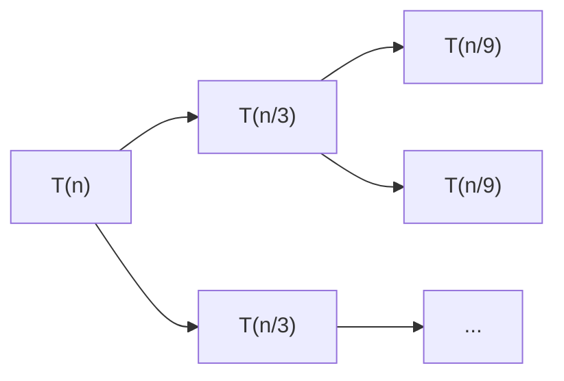

<center>

# Python Basis
</center>


# 1. Python 的数据储存方式
> **Reference - Stack Memory 栈**（特点是后进先出，空间有限）

储存所有<span style="background-color: yellow; color: black;">对象名</span>。执行方式类似于执行嵌套函数:
- 首先外部函数进入栈，然后内部函数入栈
- 内部函数执行完后先出栈，然后外部函数出栈

> **Objects - Heap Memory 堆**（特点是无序杂乱，空间大）

储存所有创建的<span style="background-color: yellow; color: black;">对象本身</span>

## 1.1 Illustration
```py
obj1 = MyObject()
id(obj1) >>> addr1
```

- `obj1` 对象名(实例的reference)，储存在 stack memeory 中
- `MyObject()` 实例(instance)，储存在 heap memory 中
- `=` 等号相当于创建了一个指针地址 address，将对象名指向实例。该地址和对象名一起储存在 stack memory 中
- `id(obj1)` 读取对象名所储存的地址


```py
obj2 = obj1
obj1 is obj2 >>> True
id(obj1) == id(obj2) >>> True
```
- 把 `obj1` 对应的地址(`addr1`)赋给了 `obj2`，此时这两个对象名储存了同一个地址，因此指向同一实例对象


```py
obj2 = MyObject()
```

- 又创建了一个新的实例对象，将其地址赋给 `obj2`
- 此时 `obj1 is obj2 >>> False` 因为指向不同实例对象
- 但是 `obj1 == obj2 >>> True` 因为他们指向的实例对象在属性值上相同


## 1.2 Examples
**函数传参的本质是传递 object address**。例如，下例中 `F()` 的执行过程相当于把 obj 对应的地址赋给 input

```py
def F(input):
    input.a += 1

obj = MyObject()
obj.a = 4
F(obj)
print(obj.a) >>> 5
```

再例如对于数组
```py
def F(lis):
  lis.append(1)
  lis = [2,3]

L = [0]
F(L)
print(L) >>> [0,1]
```

因此不管是在函数内部修改 class 的 fields 还是修改 list (list.append) 等等，都能够传递到函数外部，<span style="background-color: yellow; color: black;">因为本质上是在修改实例对象</span>

但如果在函数内部进行的是赋值操作，那就不会传递到函数外部


# 2. 文件操作
> **开关**
```py
f = open(<文件名>, <打开模式>)
# 代码块
f.close()
```
|打开模式| 描述|
|-|-|
|'t'| 文本文件模式，只读，默认值|
|'b'| 二进制文件模式，只读|
|'r'| 只读，若文件不存在会报错|
|'w'| 覆盖写入|
|'x'| 创建写入，若文件存在则报错|
|'a'| 追加写入|
|'+'| 与r/w/x/a一同使用，在原功能基础上增加同时读写功能|
|'wb'| 二进制覆盖写|
|'...'| ...|

> **读写**
```py
# 读
f.read(size)      # 读入全部（可选参数：读取前size长度）
f.readline(size)  # 读入一行（可选参数：读取前size长度）
f.readlines(hint) # 读入全部行，返回一个列表（可选参数：读取前hint行）

# 写
f.write(s)          # 写入一个字符串或字节流
f.writelines(lines) # 写入一个字符串列表
f.seek(offset)      # 改变文件操作指针的位置（0: 文件开头，1: 当前位置，2: 文件结尾）
```
例如：
```py
f.writelines(["aa", "bb"])
f.seek(0) # 不写这一行代码，该程序将不会输出任何内容
for line in f:
    print(line)
f.close()

>>>
"aabb"
```


# 3. 函数
## 3.1 常用函数
> **enumerate(List)**

```py
L = [1,0]
for i, e in enumerate(L):
  print(i, e)
>>> 
0, 1
1, 0
```

> **eval()**
执行并返回一个字符串表达式的值

```py
a = eval("1 + 4")
b = eval("a * 6")
```

> **map(参数1, 参数2)**
将参数1的方法作用于参数2得每一个元素

```py
list(map(eval, ["1+1", "2*2"])) >>> [2, 4]
```

> **max(iterable, key=func)**
使用 max + key 来发掘更多可用性

```py
# 1. 统计列表中出现频率最高的元素
a = [1,2,3,1,2,3,2,2,4,5,1]
max(set(a), key=a.count) >>> 2

# 2. 求特定位置的最大值
lst = [(1,'a'), (3,'c'), (4,'e')]
max(lst, key=lambda x: x[0]) >>> (4, 'e')
```


## 3.2 lambda function

```py
func = lambda [arg1, arg2, ...]: expression
```

Examples:

```py
power = lambda a, b: a**b
power(2, 3) >>> 8
```


# 4. Libraries
可以在 pypi.org 上根据关键字搜索第三方库
```py
pip install <库名>
pip uninstall <库名>
pip install -U <库名> # 更新库
pip download <库名> # 下载但不安装
pip show <库名> # 查看库的详细信息
pip search <库名> # 检索与该库相关的信息
```


## 4.1 Famous Libraries
**1. 数据处理**
- **数据分析**: numpy, pandas, scipy
- **数据可视化**
  - matplotlib (matplotlib.pyplot)
  - seaborn (统计类数据)
  - Mayavi (三维数据可视化)
- **文本处理**
  - PyPDF2 (处理pdf文件)
  - NLTK (自然语言文本处理)
  - Python-docx (Word文件)
  - wordcloud (绘制词云)

**2. 机器学习**: Sickit-learn, TensorFlow, MXNet (基于神经网络的深度学习计算框架)

**3. web**
- **网络爬虫**: Requests, Scrapy, pysipder
- **Web信息提取**: Beautiful Soup, Re (正则表达式), Python-Goose
- **Web网站开发**: Django (大型网站), Pyramid (中型), Flask (简易)
- **网络应用开发**: WeRobot (微信小程序), aip (百度AI框架), MyQR (定制二维码)

**4. 人机交互与设计**
- **图形用户界面 GUI**: PyQt5, wxPython, PyGObject
- **游戏开发**: PyGame (简单), Panda3D (3D渲染和游戏开发), cocos2d (专业级2D游戏)


# 5. ipython (with Jupyter)
ipython 是一个交互式 shell，同时被应用于 jupyter。有很多方便的魔法命令：

**1. 自动补全** `Tab`

**2. 执行终端命令** `!` + `终端命令`
例如 `!ifconfig`

**3. 模糊查找** `查找内容` + `?`
例如 `list_1.*pp*?` 能查找目标对象所有名字中带有 pp 字段的方法/属性

**4. 查看信息** `对象/方法` + `?`
例如 `list_1?`, `list_1.append?`

**5. 查看函数代码** `函数名` + `??`
例如 `help??` 查看help函数的使用方法

**6. 运行python程序** `%run` + `文件名.py`

**7. 使用前面代码块的输出结果** `_` 前面第一个, `__` 前面第二个, `_n` 序号为n的代码块：


## 5.1 为地址设置书签
设置书签 `%bookmark 书签名 地址`
删除书签 `%bookmark -d 书签名`
删除所有书签 `%bookmark -r`
显示所有书签 `%bookmark -l`
跳转地址 `cd 书签名`


## 5.2 代码调试 
1. 打开代码调试: `%pdb on`
2. 之后如果运行错误代码，则会跳转到报错的前一行，并打开调试器，进入 pdb 调试模式，例如：

3. 在调试器内输入调试命令，例如
```py
p 变量名 # 查看变量值
```

4. 退出调试: `q(uit)`


# 6. Time Complexity
## 6.1 Big O
$O$ usually used as Time Complexity notation. Understood as **how run time or space requirements grow as the input size grows**

Big O mathematically defined as the upper bound. 对于函数 $f(x)$，如果存在 $c\in\R$，使得 $f(x)<c\times g(x)$ 在其定义域内恒成立，则有 $f(x)\in O(g(x))$

例如，$N^3+8N+9<2(N^3)\implies O(N^3)$

## 6.2 Big Omega
$\Omega$ mathematically defined as the lower bound. 对于函数 $f(x)$，如果存在 $c\in\R$，使得 $f(x)>c\times g(x)$ 在其定义域内恒成立，则有 $f(x)\in\Omega(g(x))$

例如，$N^3+8N+9>0.5(N^3)\implies\Omega(N^3)$

## 6.3 Big Theta
$\theta$ uderstood as **the exact performance value of the algorithm**

Big Theta mathematically defined as both of the upper and lower bound i.e. if $f(x)\in O(g(x))$ and $f(x)\in\Omega(g(x))$ then $f(x)=\theta(g(x))$

<span style="background-color: yellow; color: black;">虽然已经有了这些准确的定义，但我们在平常使用时只用 Big O（相当于 Big Theta）</span>

## 6.4 Three Time Complexities
- Best Case
- Worst Case
- Average Case

一般情况下，我们最关注的是时间复杂度的 Average Case，此外还需要关注 Worst Case（其重要性取决于具体情况，例如在安全工程领域很重要）

Ex: 对于快速排序 Quick Sort
- Average Case: $O(n\log n)$
- Worst Case: $O(n^2)$

## 6.5 How to Calculate
- Program structure:
How many times is basic calculation executed (e.g. for loop; while loop)
- Master theorem:
usually useful in recursive deduction
- Mathematical deduction:
Permutation, Combination, etc.
- Mermorize common algorithms & data structures

### 6.5.1 Master theorem

$$T(n) = aT(\frac{n}{b}) + c*n^d$$

where $T(1)=d$. **IF**:
- $\log_ba>d$, then $T(n)=O(n^{\log_ba})$
- $\log_ba=d$, then $T(n)=O(n^d\log n)$
- $\log_ba<d$, then $T(n)=O(n^d)$

如何理解这个公式呢？如下图:
- $a=2$: branch factor 每次拆分时 branch 的个数
- $b=3$: division factor 每次拆分时问题规模缩小的幅度
- 从 $T(n)\to T(1)$，共 $\log_bn$ 层



**APPLICATIONs**: 常用于 recursive deduction
- Merge sort: $T(n)=2T(\frac{n}{2})+cn\implies O(n\log n)$
- Binary search: $T(n)=T(\frac{n}{2})+c\implies O(\log n)$

但是有些递归推导式不适用于 master theorem，此时可以暴力推导
- Selection sort: $T(n)=T(n-1)+cn\implies O(n^2)$
  $T(n)=cn+c(n-1)+c(n-2)+...+c=n(n+1)/2$
- Factorial: $T(n)=T(n-1)+c\implies O(n)$


### 6.5.2 Permutation, Combination
**Permutation**: 从 n 个人中挑选 k 个排成一列，有多少种挑选及排列方式

$$n\text{P}k=P(n,k)=\frac{n!}{(n-k)!}$$

**Combination**: 从 n 个人中挑选 k 个，有多少种挑选方式

$$n\text{C}k=C(n,k)=\frac{n!}{(n-k)!k!}$$

$$C(n,k)=\frac{P(n,k)}{P(k,k)}$$


### 6.5.3 Memorize common algorithms & data structures
Binary search

Insertion sort
Binary sort
Selection sort
Quick sort
Merge sort

Binary tree
Binary search tree
Recursion

Hashtable (dictionary)
www.bigocheatsheet.com


# Others
## .1 *星号的使用
星号的作用为 unpacking
```py
values = (1, 2)
sum(*values) >>> 3
```

```py
a, *b = [1, 2, 3]
a >>> 1
b >>> [2, 3]
```


